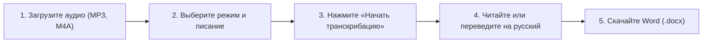

# 🎙️ VaniVoice AI — Платформа транскрибации и литературного перевода лекций

> **Специализированный открытый веб-сервис для распознавания длинных духовных, философских и академических лекций с прецизионной верификацией санскрита (IAST) и глубоким переводом на русский язык.**

🌐 **Рабочий онлайн-сервис:** [https://lecture-transcriber-eta.vercel.app](https://lecture-transcriber-eta.vercel.app)  
📦 **Исходный код:** [https://github.com/dumatel42/lecture-transcriber](https://github.com/dumatel42/lecture-transcriber)

---

## 🧭 Навигация по руководству
- [Уровень 1: Руководство пользователя (Как пользоваться сайтом)](#уровень-1-руководство-пользователя)
- [Уровень 2: Для разработчиков и энтузиастов (Как развернуть свой проект)](#уровень-2-для-разработчиков-и-энтузиастов)
- [Архитектура и ключевые особенности](#архитектура-и-технологический-стек)
- [Лицензия и вклад](#лицензия)

---

## Уровень 1: Руководство пользователя

Если вы хотите быстро получить расшифровку аудиозаписи или качественный перевод лекции, вам не нужно ничего программировать — просто откройте сайт [VaniVoice AI](https://lecture-transcriber-eta.vercel.app).

### 1. Основные возможности
1. **Аудио в текст (Транскрибация длинных лекций до 2+ часов):**
   * Поддержка всех популярных форматов: `MP3`, `M4A`, `WAV`, `AAC`, `OGG`, `WEBM`, `FLAC`.
   * **Автоматическое отсечение синхронного переводчика:** Если в аудио лектор говорит по-английски, а в паузах говорит русский переводчик, сервис распознаёт только оригинальную речь лектора.
   * **Прецизионный санскрит (стандарт Vedabase IAST):** Термины (*jīva*, *guṇas*, *bhakti*, *śāstra*) форматируются курсивом с аутентичной диакритикой (ā, ī, ū, ṛ, ṭ, ḍ, ṇ, ś, ṣ, ḥ, ṁ).
   * **Правило 1:1 для священных стихов (Anti-Hallucination):** Если лектор цитирует лишь пару слов из шлоки, сервис записывает ровно произнесённые слова, не дописывая несказанные строки.
   * **Защита от спама цитатами:** Ссылка на писание даётся один раз при цитировании шлоки, но не дублируется при пословном разборе.
   * **Умная пунктуация монологов:** Непрерывная быстрая речь разбивается на естественные предложения и читабельные абзацы.
   * **Разворот сокращений:** Разговорные `I'm`, `you're`, `we've` приводятся к книжному стандарту `I am`, `you are`, `we have`.

2. **Текст на русский язык (Литературный перевод):**
   * Перевод английских текстов и документов Microsoft Word (`.docx`).
   * 100% сохранение объёма без сокращений, структурированные главы и экспорт в готовый `.docx` файл для печати или верстки книги.

---

### 2. Пошаговая инструкция по работе с сайтом



1. **Загрузка аудио:**
   * Перетащите файл лекции в окно загрузчика. Сервис сразу покажет длительность и готовность к работе.
2. **Выбор режима:**
   * **Вайшнавская / Ведическая лекция (Рекомендуется):** Полный канонический словарь терминов, ачарьев и шлок.
   * **Оба спикера (Лектор + Переводчик):** Поочередная хронологическая запись с разделением спикеров `[Lecturer (EN)]` и `[Interpreter (RU)]`.
   * **Лекция + Конспект:** Аналитический конспект лекции (ключевые тезисы, шлоки, термины) + полный дословный текст.
   * **Академическая лекция:** Для научных и общегуманитарных лекций.
3. **Поле «Специфика / Писание лекции» (Опционально):**
   * Если лектор читает цикл по редкой книге (например, *«Джайва-дхарма»*, *«Бхакти-расамрита-синдху»*, *«Упадешамрита»*), впишите название в это поле. Нейросеть получит этот контекст как высший приоритет для сверки терминов.
4. **Таймкоды:**
   * По умолчанию выключены для чистого книжного чтения. При желании включите тумблер «Таймкоды», чтобы заголовки глав содержали временные метки `[ЧЧ:ММ:СС]`.
5. **Экспорт:**
   * Готовый текст можно в один клик перевести на русский язык, скопировать в буфер или скачать в формате Microsoft Word (`.docx`) с готовой книжной вёрсткой.

---

## Уровень 2: Для разработчиков и энтузиастов

Хотите развернуть собственную копию сервиса для своей команды, адаптировать его под другую традицию или запустить на своём домене? Это займёт 5 минут и **не требует платных серверов** (100% Free Tier).

### 🛠️ Технологический стек
* **Frontend:** React 18 + TypeScript + Vite
* **Стилизация:** Tailwind CSS + Lucide Icons
* **ИИ-ядро:** Google Gemini API (модели `gemini-2.5-flash`, `gemini-1.5-flash`)
* **Аудио-пайплайн:** Google Gemini Resumable File API (загрузка файлов до 2 ГБ напрямую из браузера)
* **Экспорт:** `docx` (генератор документов Microsoft Word с колонтитулами и стилями)
* **Хостинг:** Vercel (Edge Network)

---

### 🚀 Пошаговое руководство: Как развернуть свой клон за 5 минут

#### Шаг 1. Получите бесплатный API ключ Gemini
1. Зайдите на [Google AI Studio](https://aistudio.google.com/).
2. Войдите через Google-аккаунт и нажмите **«Get API key»** ➔ **«Create API key»**.
3. Скопируйте полученный ключ (начинается на `AIzaSy...` или `AQ.Ab8...`).
   *(Бесплатный лимит Google предоставляет до 1500 запросов в сутки — этого достаточно для десятков лекций ежедневно).*

#### Шаг 2. Клонируйте репозиторий
```bash
git clone https://github.com/dumatel42/lecture-transcriber.git
cd lecture-transcriber
```

#### Шаг 3. Установите зависимости и запустите локально
```bash
npm install
npm run dev
```
Откройте в браузере адрес: `http://localhost:5173`. Сервис уже работает! Ключ можно ввести прямо в интерфейсе через кнопку **«API ключ»** в верхнем меню.

---

#### Шаг 4. Бесплатный деплой в облако Vercel (в 1 команду)

1. Установите Vercel CLI (если не установлен):
   ```bash
   npm install -g vercel
   ```
2. Авторизуйтесь и опубликуйте проект:
   ```bash
   vercel
   ```
3. (Опционально) Задайте ваш API-ключ в настройках Vercel, чтобы пользователям вашего сайта не приходилось вводить свой ключ:
   * В панели Vercel проекта перейдите в **Settings** ➔ **Environment Variables**.
   * Добавьте переменную `VITE_GEMINI_API_KEY` со значением вашего ключа.
   * Нажмите **Redeploy**.

Готово! У вас есть собственный глобальный сервис на быстром HTTPS-домене `*.vercel.app`.

---

## 🧠 Архитектура: В чём секрет скорости и стабильности?

1. **Direct Browser-to-Cloud Streaming:**
   Традиционные веб-сервисы пересылают аудио сначала на бэкенд, упираясь в лимиты памяти серверов (25–50 МБ) и таймауты HTTP (30–60 секунд).  
   VaniVoice AI инициирует сессию Resumable Upload напрямую между браузером клиента и серверами Google Cloud. Это позволяет загружать файлы размером до **2 ГБ** без нагрузки на сервер и без таймаутов.

2. **Многоуровневая калибровка промпта:**
   Вместо перегрузки контекста громоздкими словарями на 10 000 слов, в ядро внедрена **Top-60 Golden Phonetic Map** — матрица самых частых акустических ошибок распознавания речи (омофонов), что исключает подмену терминов и не снижает скорость инференса.

3. **Соблюдение авторского объёма (Anti-Hallucination):**
   Жесткие директивы запрещают нейросети «додумывать» продолжение стихов и навязывать цитаты там, где лектор их не произносил.

---

## 📄 Лицензия и вклад в проект

Проект распространяется под открытой лицензией **MIT License**. Вы можете свободно использовать, модифицировать и внедрять этот код в образовательных, духовных и культурных проектах.

* Разработано для сообщества транскрибаторов и переводчиков философских и ведических лекций.
* Предложения по улучшению и Pull Requests приветствуются через репозиторий [GitHub](https://github.com/dumatel42/lecture-transcriber).
